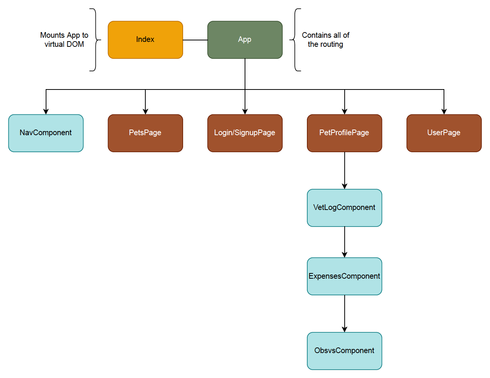
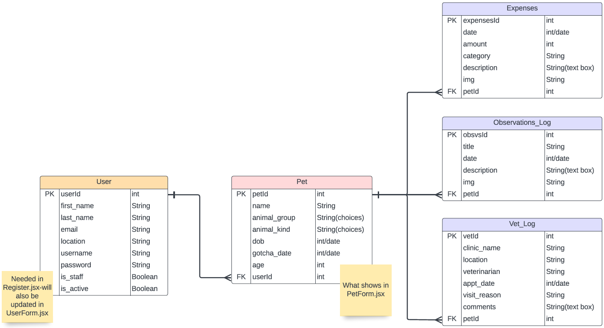

# PetCare2.0 - _Pet More, Worry Less_

## Date: 09/01-14/2022

### By: Anaflavia Almendras

#### [PetCare2.0](https://pettracker-backend.herokuapp.com/api/users/) | [GitHub](https://github.com/A-Almendras) | [LinkedIn](https://www.linkedin.com/in/aalmendras/)

---

---

### **_Description_**

_Pet More, Worry Less_

Life gets crazy and keeping track of everything and everyone in our lives that need attention can be difficult. The intention of PetCare 2.0 is to allow users to keep track of the overall health/well being of your pet(s) by adding any expenses, vet appointment summaries, and any other information they wish to reference later on.

[Frontend Repository](https://github.com/A-Almendras/pet-tracker)

#####

---

### **_Technologies_**

- HTML, CSS, Javascript, Python
- React.js
- Django
- PostgreSQL
- Heroku
- MaterialUI
- Trello, Miro

---

### **_Project Overview_**

##### PetCare2.0 is an application that allows users to ease the process of keeping track of all their furry (or not furry) loved ones, completely paperless.

##### Users will be prompt to create an account or login if they are already part of the _Pet More, Worry Less_ family. Once logged in the user should be directed to the pets page, from there they should select the pet they'll want to review or add/update information for. Users should also have the option to add a pet from the pets page which should then redirect them to a form to add their pet information. Once the user has selected a pet, they should be redirected to their pet's dashboard. From there they should be able to add, delete, or make changes to any of the expenses, vet summaries, or observations log. Users should also be able to add any photos they wish to. From there they should also be able to update any personal information regarding their pet.

##### --

##### A Trello board was used to keep track of development progress and can be viewed [here](https://trello.com/b/Xst7FccT/project-4-pet-tracker-app).

##### The project itself was deployed and can be viewed [here]().

---

### **_Screenshots_**

##### **Component Hierarchy Diagram**

##### **ERD**

---

### **_Future Updates_**

- [ ] Search, like, comment capabilities of vet clinics and veterinarians.
- [ ] Map to show location of clinics.
- [ ] Responsive/Make it into a mobile app
- [ ] Have a guest account for pet sitter (able to read only/add posts).

---

### **_Credits_**

##### MDN: _[MDN Search](https://developer.mozilla.org/en-US/)_

##### Stack Overflow: _[Stack Overflow Search](https://stackoverflow.com/)_

##### GA Lead Instructors: _Micheal Lackey & John Jacobs_
