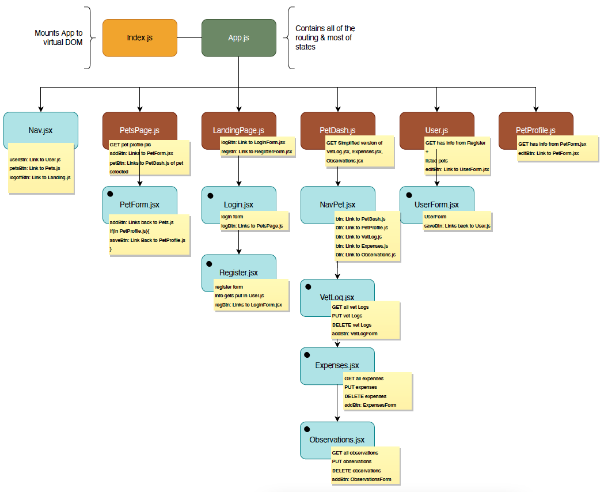

# Pet-Tracker (TBD)

## Date: 09/01-14/2022

### By: Anaflavia Almendras

#### [Pet-Tracker](https://evening-woodland-13843.herokuapp.com/) | [GitHub](https://github.com/A-Almendras) | [LinkedIn](https://www.linkedin.com/in/aalmendras/)

---

---

### **_Description_**

Pet-tracker is an application that allows you to keep track of the overall health/well being of your pet(s).

[Frontend Repository](https://github.com/A-Almendras/pet-tracker)

#####

---

### **_Technologies_**

- HTML, Javascript, Python
- React.js / Vue.js
- PostgreSQL
- Node.js
- Django
- Netlify
- Firebase

---

### **_Project Overview_**

#####

##### --

##### A Trello board was used to keep track of development progress and can be viewed [here](https://trello.com/b/Xst7FccT/project-4-pet-tracker-app).

##### The project itself was deployed and can be viewed [here](https://evening-woodland-13843.herokuapp.com/).

---

### **_Screenshots_**

##### **Component Hierarchy Diagram**

##### **ERD**

---

### **_Future Updates_**

- [ ] ...
- [x] ...

---

### **_Credits_**

##### MDN: [MDN Search](https://developer.mozilla.org/en-US/)
